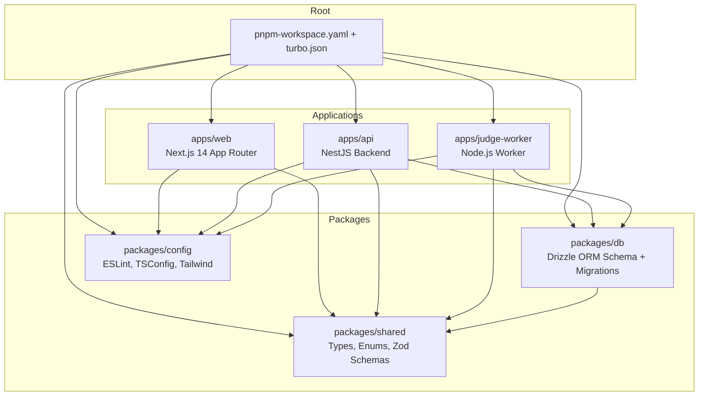
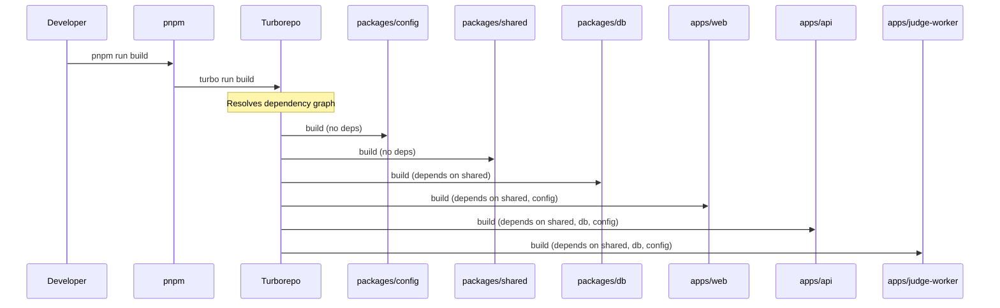
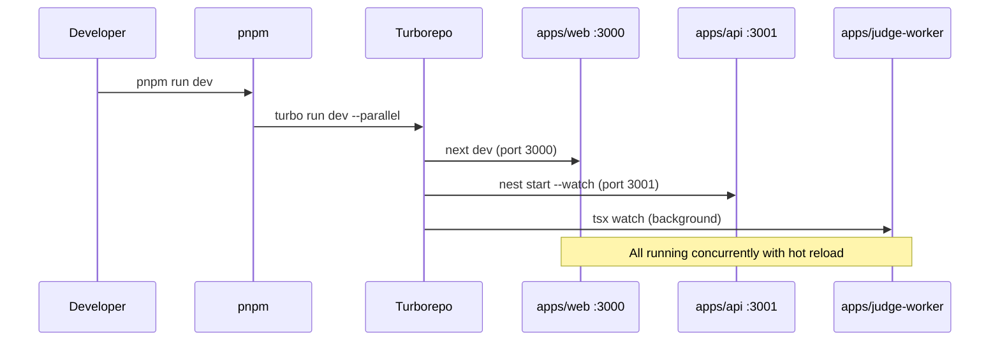

# Design Document: Monorepo Setup

## Overview

CodeForge AI is an AI-powered online coding judge platform. This design covers the production-ready monorepo scaffolding using pnpm workspaces with Turborepo for build orchestration. The monorepo contains three applications (Next.js frontend, NestJS API, standalone judge worker) and three shared packages (types/schemas, database layer, shared configs).

The goal is to establish a well-structured, type-safe foundation with shared configurations, consistent tooling, and clear dependency boundaries between packages. No application logic is implemented — only the skeleton, configs, type definitions, and Zod validation schemas.

## Architecture



## Sequence Diagrams

### Build Pipeline



### Development Workflow



## Components and Interfaces

### Component 1: Root Configuration

**Purpose**: Orchestrates the monorepo workspace, defines build pipelines, and provides shared scripts.

**Files**:
- `pnpm-workspace.yaml` — workspace package declarations
- `turbo.json` — build pipeline configuration
- `package.json` — root scripts and devDependencies
- `.nvmrc` — Node version pinning
- `.env.example` — environment variable template
- `tsconfig.json` — base TypeScript configuration

**Responsibilities**:
- Define workspace boundaries
- Configure Turborepo caching and pipeline dependencies
- Provide unified dev/build/lint/test commands
- Pin Node.js version for consistency

### Component 2: packages/shared

**Purpose**: Single source of truth for TypeScript types, enums, and Zod validation schemas shared across all applications.

**Interface**:
```typescript
// Enums
export enum Verdict { AC, WA, TLE, MLE, RE, CE, OLE, IE }
export enum Difficulty { EASY, MEDIUM, HARD }
export enum Language { CPP, PYTHON, JAVA, JAVASCRIPT }
export enum UserRole { GUEST, USER, PROBLEM_SETTER, ORG_ADMIN, PLATFORM_ADMIN }

// Interfaces
export interface Problem { ... }
export interface Submission { ... }
export interface TestCase { ... }
export interface AiReview { ... }

// Zod Schemas
export const ProblemSchema: z.ZodType<Problem>
export const SubmissionSchema: z.ZodType<Submission>
export const TestCaseSchema: z.ZodType<TestCase>
export const AiReviewSchema: z.ZodType<AiReview>
```

**Responsibilities**:
- Define all shared domain types
- Provide runtime validation via Zod schemas
- Export enums for use across frontend and backend
- Ensure type consistency across the monorepo

### Component 3: packages/db

**Purpose**: Database schema definitions and migration infrastructure using Drizzle ORM.

**Interface**:
```typescript
// Schema exports
export { problems, submissions, testCases, users } from './schema'

// Drizzle config
export { default as drizzleConfig } from './drizzle.config'
```

**Responsibilities**:
- Define database table schemas with Drizzle ORM
- Provide migration generation and execution tooling
- Export typed database client configuration

### Component 4: packages/config

**Purpose**: Shared configuration files for ESLint, TypeScript, and Tailwind CSS.

**Interface**:
```typescript
// ESLint configs
export { default as baseEslintConfig } from './eslint/base'
export { default as nextEslintConfig } from './eslint/next'
export { default as nestEslintConfig } from './eslint/nest'

// TypeScript configs (JSON, extended via tsconfig paths)
// tsconfig/base.json
// tsconfig/next.json
// tsconfig/node.json

// Tailwind preset
export { default as tailwindPreset } from './tailwind/preset'
```

**Responsibilities**:
- Provide consistent linting rules across all packages
- Define base TypeScript compiler options
- Share Tailwind CSS theme and plugin configuration

### Component 5: apps/web

**Purpose**: Next.js 14 frontend application using App Router.

**Responsibilities**:
- Skeleton Next.js app with App Router structure
- Extends shared TypeScript and ESLint configs
- Consumes types from packages/shared
- Tailwind CSS configured via shared preset

### Component 6: apps/api

**Purpose**: NestJS backend API server.

**Responsibilities**:
- Skeleton NestJS application
- Extends shared TypeScript and ESLint configs
- Consumes types from packages/shared and packages/db
- Configured for port 3001

### Component 7: apps/judge-worker

**Purpose**: Standalone Node.js process for code execution and judging.

**Responsibilities**:
- Minimal TypeScript worker skeleton
- Consumes types from packages/shared and packages/db
- Runs independently of the API server

## Data Models

### Enum: Verdict

```typescript
export enum Verdict {
  AC = "AC",           // Accepted
  WA = "WA",           // Wrong Answer
  TLE = "TLE",         // Time Limit Exceeded
  MLE = "MLE",         // Memory Limit Exceeded
  RE = "RE",           // Runtime Error
  CE = "CE",           // Compilation Error
  OLE = "OLE",         // Output Limit Exceeded
  IE = "IE",           // Internal Error
}
```

### Enum: Difficulty

```typescript
export enum Difficulty {
  EASY = "EASY",
  MEDIUM = "MEDIUM",
  HARD = "HARD",
}
```

### Enum: Language

```typescript
export enum Language {
  CPP = "CPP",
  PYTHON = "PYTHON",
  JAVA = "JAVA",
  JAVASCRIPT = "JAVASCRIPT",
}
```

### Enum: UserRole

```typescript
export enum UserRole {
  GUEST = "GUEST",
  USER = "USER",
  PROBLEM_SETTER = "PROBLEM_SETTER",
  ORG_ADMIN = "ORG_ADMIN",
  PLATFORM_ADMIN = "PLATFORM_ADMIN",
}
```

### Interface: Problem

```typescript
export interface Problem {
  id: string;
  title: string;
  slug: string;
  statement: string;
  difficulty: Difficulty;
  constraints: string;
  tags: string[];
  timeLimitMs: number;
  memoryLimitMb: number;
  isSpecialJudge: boolean;
}
```

**Validation Rules**:
- `id` must be a non-empty string (UUID format)
- `title` must be 1-200 characters
- `slug` must be lowercase alphanumeric with hyphens
- `timeLimitMs` must be positive integer (100-30000)
- `memoryLimitMb` must be positive integer (16-1024)
- `tags` must be an array of non-empty strings

### Interface: Submission

```typescript
export interface Submission {
  id: string;
  userId: string;
  problemId: string;
  language: Language;
  code: string;
  verdict: Verdict;
  runtimeMs: number;
  memoryKb: number;
  testCasesPassed: number;
  totalTestCases: number;
}
```

**Validation Rules**:
- `id`, `userId`, `problemId` must be non-empty strings (UUID format)
- `code` must be non-empty string (max 100KB)
- `runtimeMs` must be non-negative number
- `memoryKb` must be non-negative number
- `testCasesPassed` must be <= `totalTestCases`
- `totalTestCases` must be positive integer

### Interface: TestCase

```typescript
export interface TestCase {
  id: string;
  problemId: string;
  input: string;
  expectedOutput: string;
  isHidden: boolean;
  category: string;
}
```

**Validation Rules**:
- `id`, `problemId` must be non-empty strings (UUID format)
- `input` and `expectedOutput` must be defined strings
- `category` must be non-empty string

### Interface: AiReview

```typescript
export interface AiReview {
  timeComplexity: string;
  spaceComplexity: string;
  correctnessNotes: string;
  optimizationHint: string;
  dryRun: string;
}
```

**Validation Rules**:
- All fields must be non-empty strings
- `timeComplexity` and `spaceComplexity` should follow Big-O notation format

## Algorithmic Pseudocode

### Workspace Resolution Algorithm

```typescript
/**
 * ALGORITHM: resolveWorkspacePackages
 * INPUT: pnpm-workspace.yaml configuration
 * OUTPUT: Ordered list of packages respecting dependency graph
 */
function resolveWorkspacePackages(workspaceConfig: WorkspaceConfig): Package[] {
  // Step 1: Discover all packages matching glob patterns
  const packages = discoverPackages(workspaceConfig.packages)
  // packages = ["packages/config", "packages/shared", "packages/db", 
  //             "apps/web", "apps/api", "apps/judge-worker"]

  // Step 2: Build dependency graph from package.json files
  const graph = buildDependencyGraph(packages)

  // Step 3: Topological sort for build order
  const buildOrder = topologicalSort(graph)
  // Result: [config, shared] → [db] → [web, api, judge-worker]

  return buildOrder
}
```

**Preconditions:**
- `workspaceConfig.packages` contains valid glob patterns
- All referenced packages exist on disk
- No circular dependencies between packages

**Postconditions:**
- Returns all packages in valid build order
- Packages with no dependencies appear first
- Dependent packages appear after their dependencies

### Turborepo Pipeline Resolution

```typescript
/**
 * ALGORITHM: resolvePipeline
 * INPUT: turbo.json pipeline configuration, target task
 * OUTPUT: Execution plan with caching decisions
 */
function resolvePipeline(config: TurboConfig, task: string): ExecutionPlan {
  const pipeline = config.pipeline[task]
  
  // Step 1: Resolve task dependencies
  const deps = pipeline.dependsOn ?? []
  // e.g., build.dependsOn = ["^build"] means build deps first

  // Step 2: Check cache for each package
  for (const pkg of packages) {
    const cacheKey = computeHash(pkg.inputs, pkg.env)
    if (cacheExists(cacheKey)) {
      markCached(pkg, task)
    } else {
      markPending(pkg, task)
    }
  }

  // Step 3: Return execution plan
  return { cached: cachedPackages, pending: pendingPackages, order: buildOrder }
}
```

**Preconditions:**
- `task` exists in `config.pipeline`
- All package inputs are accessible for hashing

**Postconditions:**
- Cached packages are not re-executed
- Pending packages execute in dependency order
- Cache keys are deterministic for same inputs

## Key Functions with Formal Specifications

### Function: createWorkspaceConfig

```typescript
function createWorkspaceConfig(): PnpmWorkspaceConfig {
  return {
    packages: ["apps/*", "packages/*"]
  }
}
```

**Preconditions:**
- None (pure configuration factory)

**Postconditions:**
- Returns object with `packages` array containing exactly `["apps/*", "packages/*"]`
- Glob patterns match all directories under apps/ and packages/

### Function: createTurboConfig

```typescript
function createTurboConfig(): TurboConfig {
  return {
    $schema: "https://turbo.build/schema.json",
    globalDependencies: ["**/.env.*local"],
    pipeline: {
      build: { dependsOn: ["^build"], outputs: ["dist/**", ".next/**"] },
      dev: { cache: false, persistent: true },
      lint: { dependsOn: ["^build"] },
      test: { dependsOn: ["build"] }
    }
  }
}
```

**Preconditions:**
- None (pure configuration factory)

**Postconditions:**
- `pipeline.build` depends on upstream builds (`^build`)
- `pipeline.dev` is not cached and runs persistently
- `pipeline.lint` depends on upstream builds
- `pipeline.test` depends on local build completion
- `outputs` correctly identifies build artifacts for caching

### Function: createZodSchema (for Problem)

```typescript
function createProblemSchema(): z.ZodType<Problem> {
  return z.object({
    id: z.string().uuid(),
    title: z.string().min(1).max(200),
    slug: z.string().regex(/^[a-z0-9]+(-[a-z0-9]+)*$/),
    statement: z.string().min(1),
    difficulty: z.nativeEnum(Difficulty),
    constraints: z.string(),
    tags: z.array(z.string().min(1)),
    timeLimitMs: z.number().int().min(100).max(30000),
    memoryLimitMb: z.number().int().min(16).max(1024),
    isSpecialJudge: z.boolean(),
  })
}
```

**Preconditions:**
- Zod library is available
- `Difficulty` enum is defined

**Postconditions:**
- Schema validates all fields according to Problem interface
- Invalid data throws ZodError with descriptive messages
- Valid data passes through unchanged
- Schema type matches `Problem` interface exactly

### Function: createBaseTypescriptConfig

```typescript
function createBaseTypescriptConfig(): TSConfig {
  return {
    compilerOptions: {
      target: "ES2022",
      module: "ESNext",
      moduleResolution: "bundler",
      strict: true,
      esModuleInterop: true,
      skipLibCheck: true,
      forceConsistentCasingInFileNames: true,
      resolveJsonModule: true,
      isolatedModules: true,
      declaration: true,
      declarationMap: true,
      sourceMap: true,
    },
    exclude: ["node_modules", "dist"]
  }
}
```

**Preconditions:**
- None (pure configuration factory)

**Postconditions:**
- `strict` mode is enabled for maximum type safety
- `declaration` and `declarationMap` enabled for package consumers
- `module` set to ESNext for tree-shaking support
- `target` set to ES2022 for Node 20 compatibility

## Example Usage

```typescript
// Example 1: Installing dependencies and running dev
// $ pnpm install
// $ pnpm run dev  → runs all apps in parallel via Turborepo

// Example 2: Building the entire monorepo
// $ pnpm run build  → builds packages first, then apps (respects dependency graph)

// Example 3: Using shared types in apps/api
import { Problem, Verdict, ProblemSchema } from "@codeforge/shared";

const rawData = await request.json();
const problem: Problem = ProblemSchema.parse(rawData);

if (problem.difficulty === Difficulty.HARD) {
  // handle hard problem
}

// Example 4: Using shared types in apps/web
import { Submission, SubmissionSchema } from "@codeforge/shared";

const submission: Submission = {
  id: "uuid-here",
  userId: "user-uuid",
  problemId: "problem-uuid",
  language: Language.PYTHON,
  code: "print('hello')",
  verdict: Verdict.AC,
  runtimeMs: 42,
  memoryKb: 1024,
  testCasesPassed: 10,
  totalTestCases: 10,
};

// Example 5: Importing database schema in apps/api
import { problems, submissions } from "@codeforge/db";

// Example 6: Extending shared ESLint config
// apps/web/.eslintrc.js
module.exports = {
  extends: ["@codeforge/config/eslint/next"],
};
```

## Correctness Properties

The following properties must hold for the monorepo setup:

1. **Workspace Completeness**: All 6 packages (3 apps + 3 packages) are discoverable by pnpm workspace resolution.

2. **Dependency Acyclicity**: The package dependency graph contains no cycles. `packages/config` and `packages/shared` have no internal workspace dependencies. `packages/db` depends only on `packages/shared`.

3. **Type Consistency**: All applications importing from `@codeforge/shared` receive the same type definitions. Zod schemas validate to the exact same shape as their corresponding TypeScript interfaces.

4. **Build Order Determinism**: Turborepo always builds packages before apps. `packages/shared` and `packages/config` build before `packages/db`. All packages build before any app.

5. **Configuration Inheritance**: Every `tsconfig.json` in apps extends the base config from root. ESLint configs in apps extend from `packages/config`.

6. **Environment Variable Completeness**: `.env.example` contains all variables referenced across all applications.

7. **Schema-Interface Alignment**: For every exported interface `T`, there exists a corresponding Zod schema `TSchema` such that `z.infer<typeof TSchema>` is structurally equivalent to `T`.

## Error Handling

### Error Scenario 1: Missing Workspace Package

**Condition**: A package referenced in `pnpm-workspace.yaml` glob doesn't exist on disk.
**Response**: pnpm install fails with "workspace package not found" error.
**Recovery**: Create the missing package directory with a valid `package.json`.

### Error Scenario 2: Circular Dependency

**Condition**: Package A depends on Package B which depends on Package A.
**Response**: Turborepo detects cycle and fails with descriptive error.
**Recovery**: Restructure dependencies to break the cycle (extract shared code to a new package).

### Error Scenario 3: TypeScript Config Resolution Failure

**Condition**: An app's `tsconfig.json` references a non-existent base config path.
**Response**: TypeScript compiler fails with "cannot find referenced project" error.
**Recovery**: Verify `extends` path is correct relative to the app's location.

### Error Scenario 4: Zod Schema Mismatch

**Condition**: Zod schema definition diverges from TypeScript interface.
**Response**: TypeScript compilation error at schema definition site.
**Recovery**: Update schema to match interface or vice versa (single source of truth pattern).

## Testing Strategy

### Unit Testing Approach

- Test Zod schema validation with valid and invalid inputs
- Test that all enum values are correctly defined
- Test TypeScript compilation of all packages independently
- Use Vitest as the test runner across all packages

### Property-Based Testing Approach

**Property Test Library**: fast-check

- Generate random `Problem` objects and verify they pass `ProblemSchema` validation
- Generate random strings and verify `slug` regex rejects invalid formats
- Verify `testCasesPassed <= totalTestCases` constraint in `SubmissionSchema`

### Integration Testing Approach

- Verify `pnpm install` resolves all workspace dependencies
- Verify `pnpm run build` completes successfully with correct build order
- Verify `pnpm run lint` passes on all packages
- Verify cross-package imports resolve correctly at compile time

## Performance Considerations

- **Turborepo Caching**: Remote caching can be enabled for CI/CD to avoid redundant builds. Local `.turbo` cache speeds up repeated local builds.
- **pnpm Efficiency**: pnpm's content-addressable store deduplicates node_modules across packages, reducing disk usage and install time.
- **Incremental Builds**: TypeScript `composite` projects enable incremental compilation. Only changed packages rebuild.
- **Parallel Execution**: `turbo run dev --parallel` runs all dev servers concurrently, utilizing available CPU cores.

## Security Considerations

- **Environment Variables**: Secrets stored in `.env` files (gitignored). `.env.example` contains only placeholder values.
- **Dependency Pinning**: Use exact versions in `package.json` to prevent supply chain attacks via version ranges.
- **NEXT_PUBLIC_ Prefix**: Only variables prefixed with `NEXT_PUBLIC_` are exposed to the browser bundle. Sensitive keys (JWT secrets, API keys) never use this prefix.
- **.gitignore**: Ensure `.env`, `node_modules`, `dist`, `.next`, and `.turbo` are all gitignored.

## Dependencies

### Root DevDependencies
- `turbo` — Build orchestration
- `typescript` — Base TypeScript compiler

### packages/shared
- `zod` — Runtime schema validation

### packages/db
- `drizzle-orm` — TypeScript ORM
- `drizzle-kit` — Migration tooling
- `pg` — PostgreSQL driver

### packages/config
- `eslint` — Linting
- `@typescript-eslint/eslint-plugin` — TypeScript linting rules
- `tailwindcss` — CSS framework
- `prettier` — Code formatting

### apps/web
- `next` (v14) — React framework
- `react`, `react-dom` — UI library
- `tailwindcss` — Styling

### apps/api
- `@nestjs/core`, `@nestjs/common` — NestJS framework
- `@nestjs/platform-express` — HTTP adapter

### apps/judge-worker
- `tsx` — TypeScript execution
